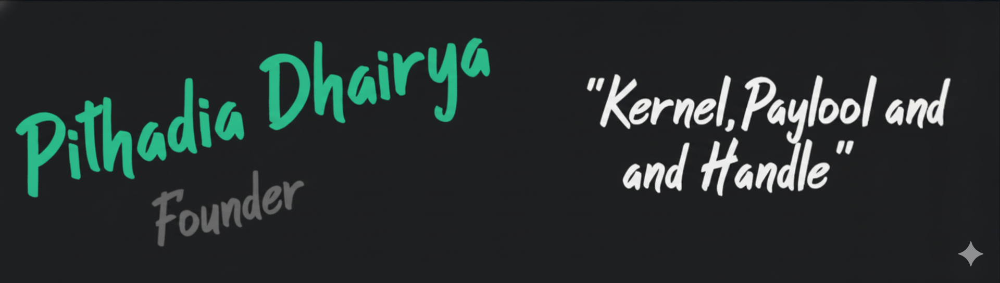

  
  
  
  
  

 

<h2 align="center"> 🖥️ <em>Terminal Portrait</em></h2>

  

 

<h2 align="center">  <em>About me</em></h2>

 

  Hello There! <em><b> I'm Dhairya Pithadia </b></em>, Founder of <b>HackStone</b> — an IT & Cybersecurity company, and <b>CraftTech</b> — a graphic design company. I'm a Computer Engineering student passionate about cybersecurity, ethical hacking, and building private cloud infrastructure from scratch.

 

      <em><b> Founder at HackStone — IT & Cybersecurity Company </b></em>  
      <em><b> Founder at CraftTech — Graphic Design Company </b></em> 
      <em><b> Computer Engineering Student — Final Year </b></em> 
      <em><b> Chess Player </b></em> 

 
 

<h2 align="center">  <em> Technologies </em> </h2>

  
  
  
  
  
  
  
  
  
  
  
  
  
  
  
  
  
  
  
  
  
  
  
  
  

 

<h2 align="center"> 💬 <em> Quote </em> </h2>

 

  <em><b>« The quieter you become, the more you are able to hear. »</b></em>
   
  — Kali Linux motto &amp; hacker's philosophy

 

<h2 align="center">  <em> Statistics </em> </h2>

  

  
  

  

  

